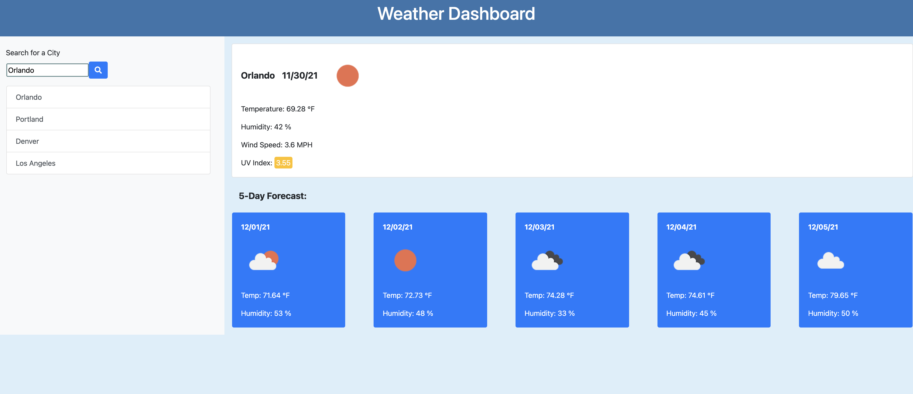

# Weather Dashboard 
  
## Contents
  
* [Description](#description)
* [Installation](#installation)
* [Contributions](#contributions)
* [Questions](#questions)
    
## [Description](#Contents)
  
This project uses HTML, CSS, Javascript, and Server Side Api's to fetch weather based on a searched city.
  
## [Installation](#Contents)
  
To run this project, click the link below and type in a city. The weather for today and 5 day forecast will then appear!

[Weather Dashboard](https://caseylister.github.io/Weather-Dashboard/)

  
  
For more information on Markdown syntax and how to add screenshots, visit the following website:
[Markdown Guide](https://www.markdownguide.org/)
  
     
  
## [Contributions](#Contents)
  
Thank you for your interest in assisting with my project! At this time, I will not be accepting contributions.
  
  
## [Questions](#Contents)
  
You can contact me by clicking the following links!
  
[Email: caseynlister@gmail.com](mailto:caseynlister@gmail.com)
  
[GitHub](https://github.com/caseylister)